# 计算机网络网课笔记

* [韩立刚老师网课视链接](https://www.bilibili.com/video/BV11Z4y1R7Am?p=1&vd_source=1dc1f5616fa7bc05e0def8e62f42c924)

* [参考笔记知乎](https://zhuanlan.zhihu.com/p/580706560?utm_id=0)

* [参考笔记二次元](https://hillzhang1999.gitee.io/2020/05/22/ji-suan-ji-wang-luo-quan-bu-fu-xi-bi-ji/)

* [参考笔记CSDN](https://blog.csdn.net/am_student/article/details/122162653)
---

## 一、计算机网络概述
#### 1. 互联网的两个特点：连通性和共享性

#### 2. 因特网发展的三个阶段

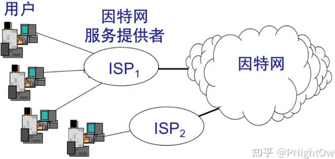

* 第一阶段是从单个网络 ARPANET 向互联网发展的过程。 1983 年 TCP/IP 协议成为 ARPANET 上的标准协议。 人们把 1983 年作为因特网的诞生时间。
* 第二阶段的特点是建成了三级结构的因特网。 三级计算机网络，分为主干网、地区网和校园网（或企业网）。
* 第三阶段的特点是逐渐形成了多层次 ISP 结构的因特网。 出现了因特网服务提供者 ISP (Internet Service Provider)

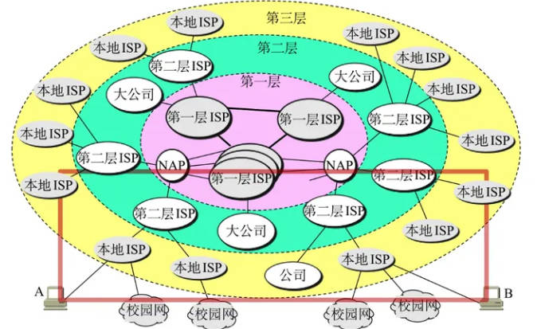

#### 3. 互联网的组成

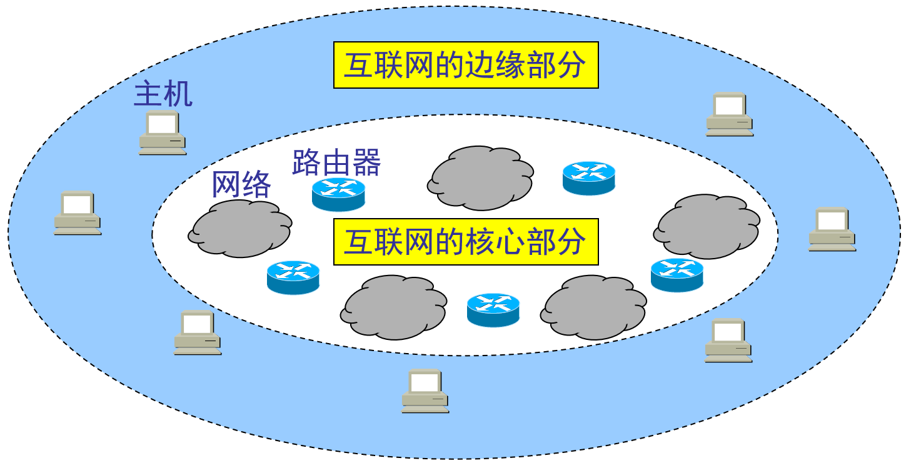
* 边缘部分：由所有连接在互联网上的主机组成，这部分是用户直接使用的。其目的是进行通信和资源共享
* 核心部分：由大量网络和连接这些网络的路由器组成。这部分是为边缘部分提供服务的，提供连通性和交换。

####4. 边缘部分的通信方式
计算机之间通信：“主机 A 和主机 B 进行通信”实际上是指 “运行在主机 A 上的某个程序和运行在主机 B 上的另一个程序进行通信”

* 客户端/服务器方式（C/S方式）
  * 一方是客户，一方是服务器
  * 客户端（Client）：被用户调用后运行，在打算通信时主动向远地服务器发起通信（请求服务）。因此，客户程序必须知道服务器程序的地址。不需要特殊的硬件和很复杂的操作系统
  * 服务器（Server）：一种专门用来提供某种服务的程序，可同时处理多个远地或本地客户的请求。系统启动后即自动调用并一直不断地运行着，被动地等待并接受来自各地的客户的通信请求。因此，服务器程序不需要知道客户程序的地址。一般需要强大的硬件和高级的操作系统支持 

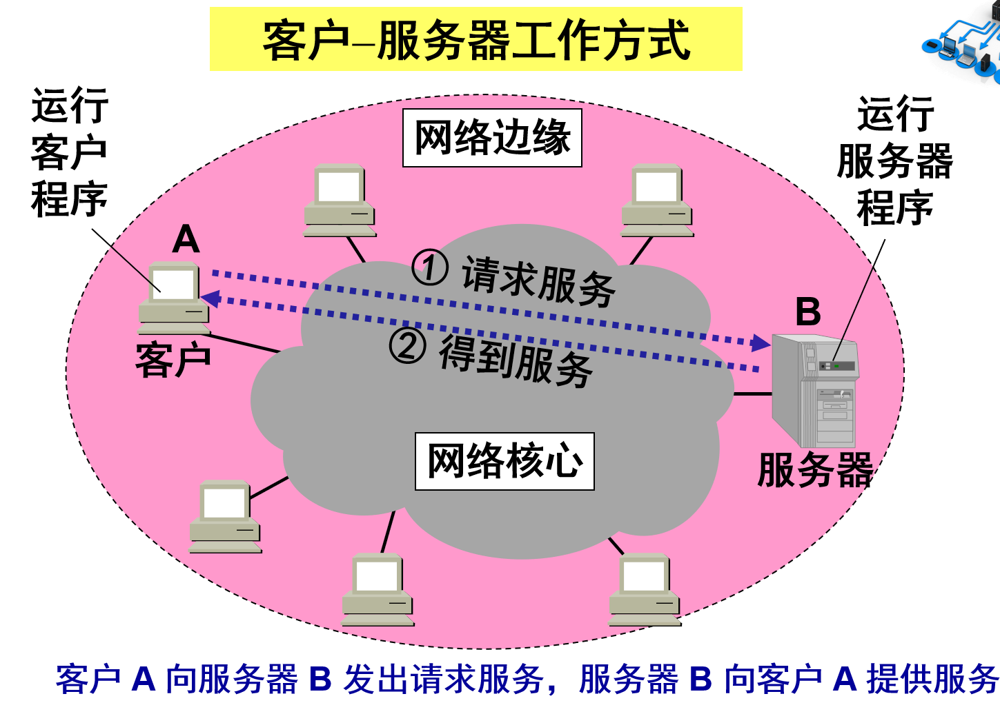

* 对等连接方式（P2P方式）
  * peer-to-peer
  * 本质上看仍然是使用客户服务器方式，只是对等连接中的每一个主机既是客户又是服务器
  * 两个主机在通信时并不区分哪一个是服务请求方还是服务提供方。 只要两个主机都运行了对等连接软件（P2P 软件），它们就可以进行平等的、对等连接通信。 双方都可以下载对方已经存储在硬盘中的共享文档

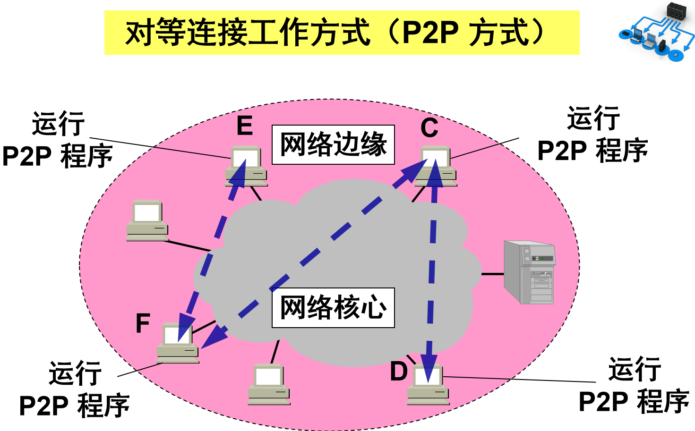

#### 5. 核心部分的交换方式

在互联网核心部分中起特殊作用的是路由器，它是一种专用计算机，是实现**分组交换**的关键构件，作用是按**存储转发**方式进行分组交换。其任务是转发收到的分组，这是网络核心部分最重要的功能。

* 电路交换：整个报文的比特流连续地从源点直达终点，好像在一个管道中传送。缺点是在通话的全部时间里，通话的两个用户需要始终占用端到端的通信资源。这在计算机网络中效率很低，因为计算机数据往往是突发式的出现在传输线路上的。
* 报文交换：整个报文先传送到相邻结点，全部存储下来后查找转发表，转发到下一个结点。一旦出错将使整个报文失效，不够灵活。
* 分组交换：分组（报文的一部分）先传送到相邻结点，全部存储下来后查找转发表，转发到下一个结点。最终，接收方接收所有的分组，并将其还原为最初的报文。优点是时延小，灵活性好，是计算机网络中最常用的交换方式。

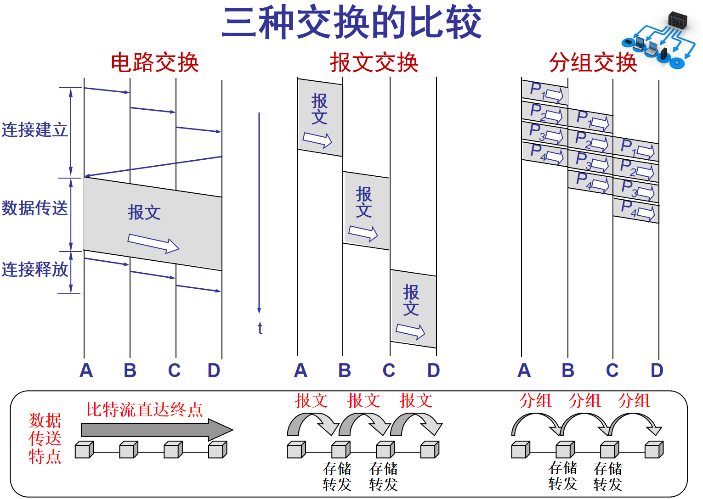

#### 6. 计算机网络的定义

* 计算机网络主要是由一些通用的、可编程（必然含有CPU）的硬件互连而成的，而这些硬件并非专门用来实现某一特定目的（例如，传送数据或视频信号）。这些可编程的硬件能够用来传送多种不同类型的数据，并能支持广泛的和日益增长的应用。
* 计算机网络所连接的硬件，并不限于一般的计算机，而是包括了智能手机。
* 计算机网络并非专门用来传送数据，而是能够支持很多种的应用（包括今后可能出现的各种应用）。

#### 7. 计算机网络的分类

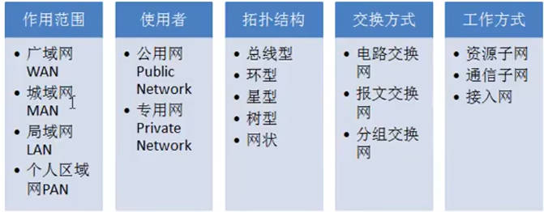

* 按照作用范围划分：
  * 局域网（local area network, LAN）：局限在较小的范围（如 1 公里左右）；自己购买设备，自己维护，带宽固定；用了局域网技术
  * 广域网（wide area net，WAN）：花钱买服务，花钱买带宽；用了广域网技术
  * 城域网（metropolitan area net，MAN）：范围5-50公里
  * 个人区域网（personal area network, PAN ）：范围很小，大约在 10 米左右

#### 8. 计算机网络的性能指标

1. 速率：单位时间内的数据传送速率，也叫数据率或比特率（单位：bit/s）。强调单个信道，多个信道的速率不能直接相加作为总速率。速率往往是指额定速率或标称速率，非实际运行速率。
2. 带宽：表示网络中某通道传送数据的能力。表示在单位时间内网络中的某信道所能通过的“最高数据率”。单位是 bit/s ，即 “比特每秒”。与速率的区别：速率指的是信道传输的标准速率，而带宽指的是最高速率。例如，电信公司安装的宽带，通常会说带宽为100兆，但实际上速率只有10兆左右。
3. 吞吐率：单位时间内通过某个网络（信道、接口）的实际数据量。多个信道的实际数据量可直接相加作为经过某接口的吞吐量。
4. 发送时延：数据（一个报文或分组，甚至比特）从网络的一端传到另一端所需要的时间
   * 发送时延：主机或路由器发送数据帧所需要的时间。$$发送时延=\frac{数据块长度(bit)}{信道宽度(bit/s)}$$
   * 传播时延：电磁波在信道中传输所需的时间。$$传播时延=\frac{信道长度(m)}{信号在信道上的传播速率(m/s)}$$
   * 排队时延：分组在路由器中需要先排队等待处理，再排队等待发送
   * 处理时延：主机或路由器收到数据帧处理所需要的时间
   * 注意：对于高速网络链路，我们提高的仅仅是数据的发送速率（即上述的速率），而不是比特在链路上的传播速率（即信号在信道上的传播速率）
   * 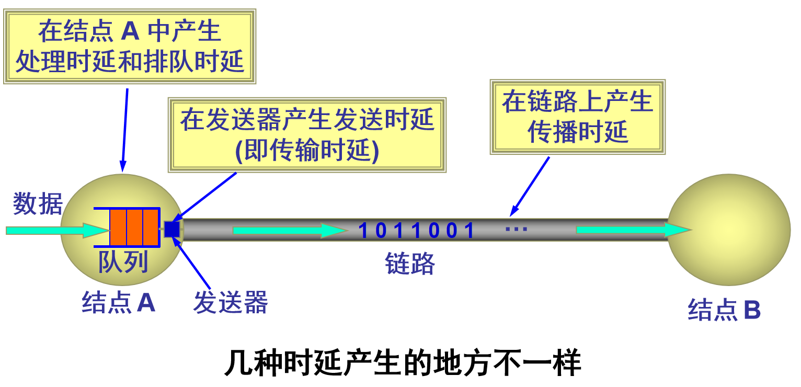
5. 时延带宽积：时延乘以带宽。又称以比特为单位的链路长度
6. 往返时间 RTT：双向交互一次所需要的时间（注意：不包括发送方和接收方的发送时延）$$RRT=传播时延+各中间结点的处理时延、排队时延以及转发数据时的发送时延$$
7. 利用率：利用率并非越高越好，高利用率会导致高时延
   * 信道利用率：某信道有百分之几的时间是被利用的（有数据通过）。完全空闲的信道的利用率是零
   * 网络利用率：全网络的信道利用率的加权平均值
   * 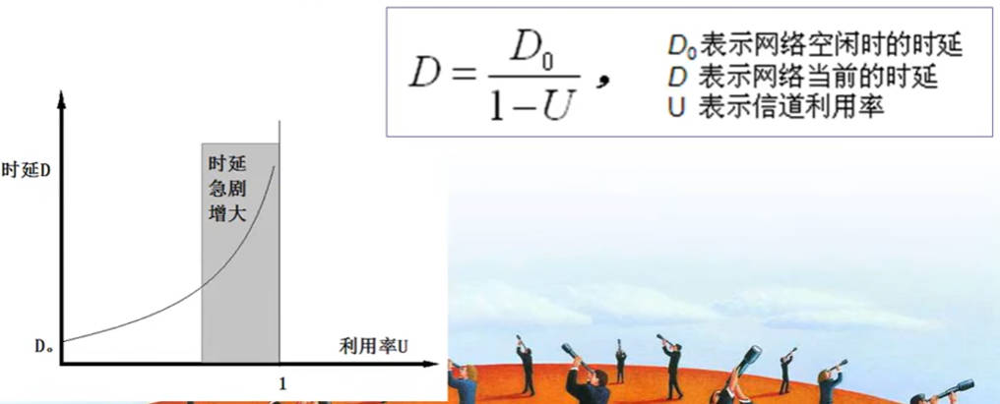

#### 9. OSI参考模型

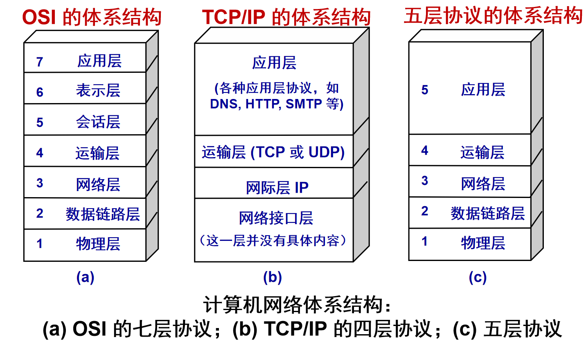

#### 五层协议结构：

##### （1）应用层
* 功能：通过应用进程之间的交互来完成特定的网络应用。
* 交换的数据单元：报文。
* 协议：域名系统DNS、支持万维网应用的HTTP协议，支持电子邮件的SMTP等。

##### （2）运输层
* 功能：负责向两台主机中进程之间的通信提供通用的数据传输服务。具有复用和分用的功能。
* 协议：
  * 传输控制协议TCP：提供面向连接的、可靠的数据传输服务。交换的数据单元是：TCP报文段。
  * 用户数据报协议UDP：提供无连接的尽最大努力的数据传输服务（不确保数据的可靠性）。交换的数据单元是：用户数据报。
  * 不同的应用层协议基于不同的传输层协议。例如：HTTP协议、SMTP协议基于TCP协议，DNS协议、RTP协议基于UDP协议。

##### （3）网络层
* 功能：为互联网内任意两台主机提供分组交换的通信服务。（路由器是网络层设备）
* 交换数据单元：分组（IP数据报）。
* 协议：网际协议IP。

##### （4）数据链路层
* 功能：为局域网内任意两台主机提供数据帧传输。
* 交换的数据单元：数据帧。

##### （5）物理层
* 功能：提供原始的比特流传输。

##### 五层协议对应的数据单元

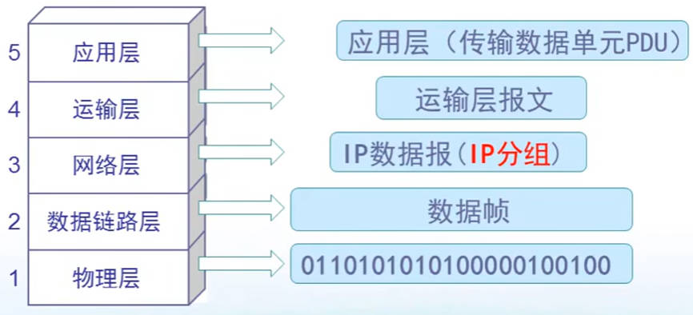

* 现在从最顶部的应用层需要发送的数据开始，描述逐层的数据是如何加工处理的：应用层的整块数据到达运输层会被分为若干段，然后在这些段的前面都加上协议识别的小一段（如协议是TCP/IP）就是运输层报文，也称为**数据段**
* 接着在网络层上，在数据段前加上IP地址就是IP数据报，也称为**数据包**
* 接着在数据链路层上，在数据包前加上MAC地址，就是**数据帧**
* 最后在物理层上，在数据帧上加上帧头和帧尾，就变成了**比特流**
* 主机1在顶部到底部是一层层加上首部和尾部发送到物理线路，当这个信息由物理线路传到主机2时则是一层层剥开首部和尾部

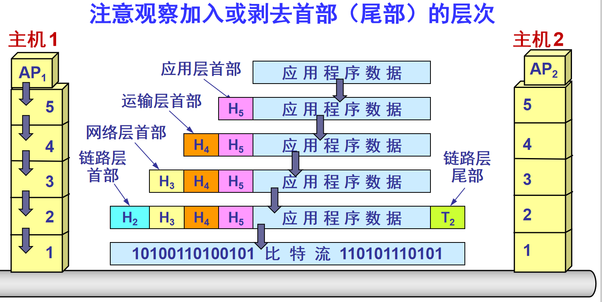

#### OSI的七层协议结构：

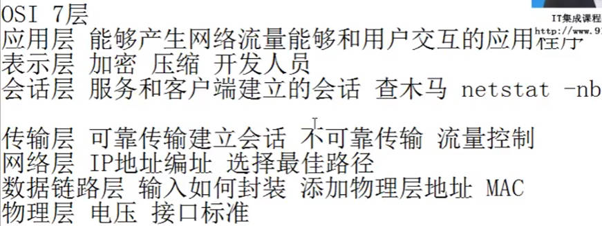
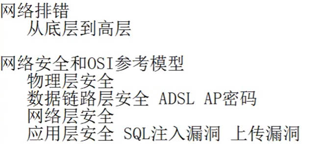

* 顶部三层是软件开发人员需要考虑的，接下来的三层是网络工程师需要考虑的，最底层是已经固定好的了

* TCP/IP协议族：沙漏型，有很多协议，其中最主要的是运输层的TCP协议，网络层的IP协议。

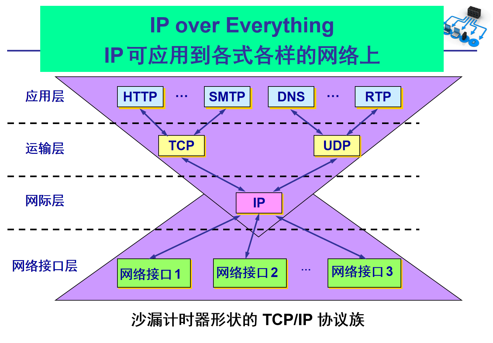

## 二、物理层

### 1. 常用概念

* 物理层的基本功能：提供原始的比特流传输。尽可能地屏蔽掉不同传输媒体和通信手段的差异。
* 主要任务：（1）确定与传输媒体的接口有关的一些特性，如机械特性、电气特性、功能特性、过程特性；（2）完成数据在计算机内部（并行传输）与通信线路上（串行传输）之间的串并传输方式的转换。

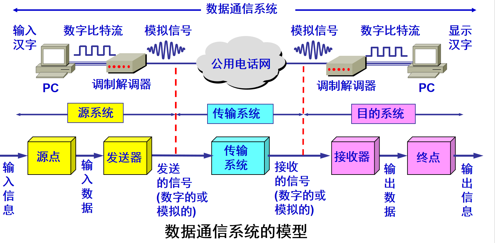

#### 相关术语

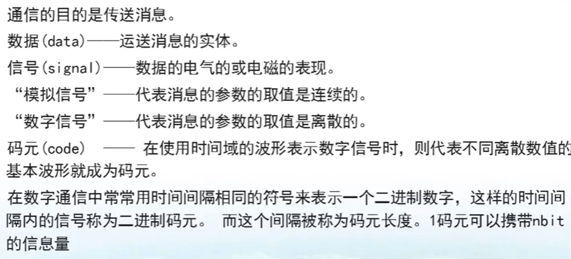

#### 信道基本概念

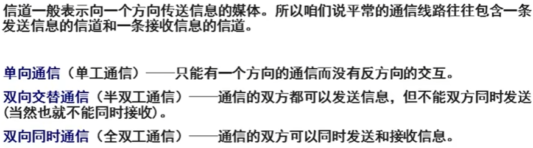

* 单工：如收音机；半双工：如对讲机；全双工：如电话

#### 基带信号与带通信号

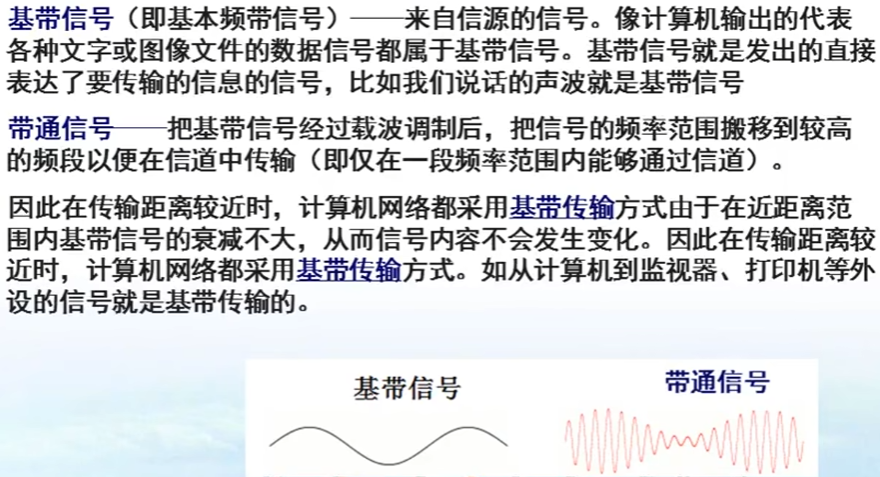

#### 调制方法
##### （1）基带调制（编码）

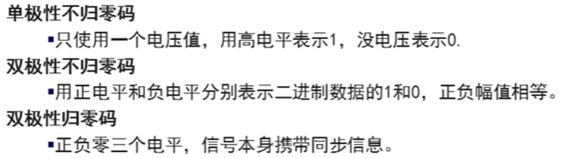

* 不归零制：正电平代表 1，负电平代表 0。
* 归零制：正脉冲代表 1，负脉冲代表 0。
* 曼彻斯特编码：位周期中心的向上跳变代表 0，位周期中心的向下跳变代表 1。但也可反过来定义。
* 差分曼彻斯特编码：在每一位的中心处始终都有跳变。位开始边界有跳变代表 0，而位开始边界没有跳变代表 1。

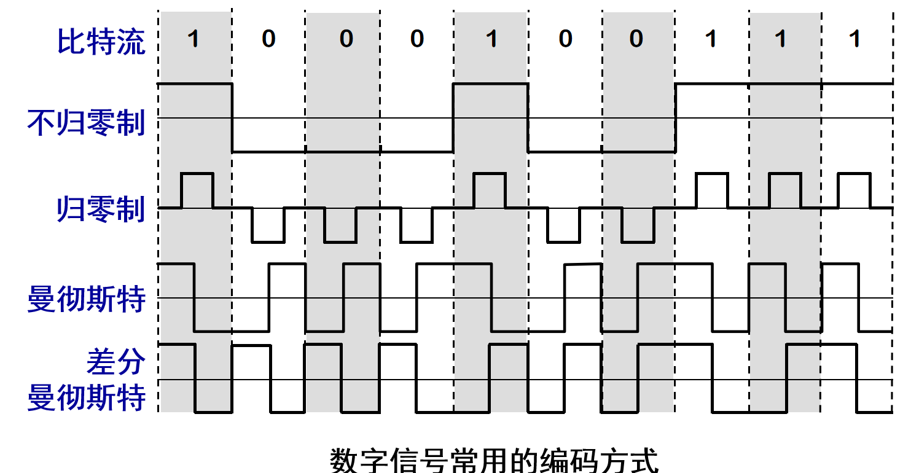

##### （2）带通调制

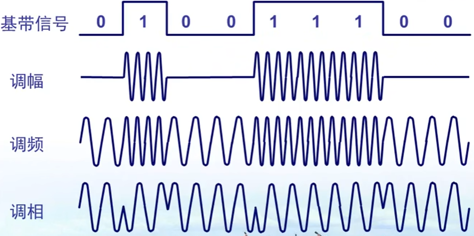

####奈氏准则

在任何信道中，码元的传输速率是有上限的，否则就会产生码间串扰的问题。

$$理想低通信道的最高码元传输速率=2W Baud$$

* W是理想低通信道的带宽，单位为Hz
* Baud是波特，是码元传输速率的单位，如果一个码元含有3个bit的信息量，则$1Baud=3bit/s$

#### 香农公式

香农公式：1984年，香农用信息论的理论推导出了带宽受限且有高斯白噪声干扰的信道的极限、无差错的信息传输速率
$$C=W{\rm log}_2(1+\frac{S}{N})\quad{}b/s$$

* W 为信道的带宽（以 Hz 为单位）
* S 为信道内所传信号的平均功率
* N 为信道内部的高斯噪声功率

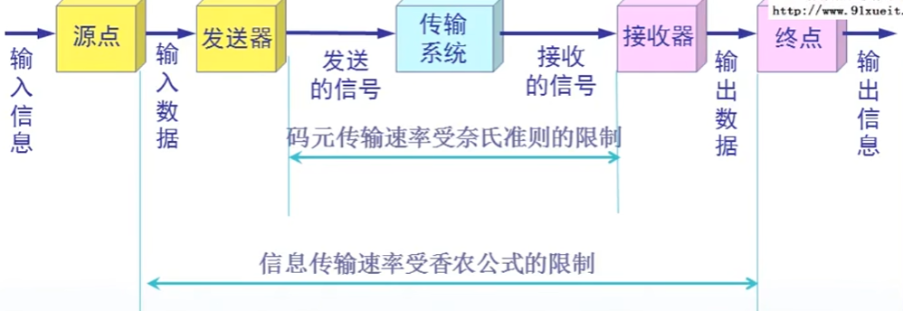

#### 信道复用技术

允许多个用户使用共享信道通信，降低成本，提高利用率

1. 频分复用FDM：用户在同样的时间内占用不同的频率带宽而复用同一个信道
2. 时分复用TDM：将时间划分为相同的时分复用帧TDM，用户在不同的时间占用相同的频带宽度
3. 统计时分复用STDM ：改进的时分复用，按需动态分配时隙，而不是固定分配时隙
4. 波分复用WDM：光的频分复用，利用在光纤技术通信中
5. 码分复用CDM: 每个用户在相同的时间使用相同的频带进行通信，但各用户使用经过挑选的不同码型，从而使得个用户之间可以进行独立的通信，下面是码分多址CDMA的原理，假设S站是某个手机，他发送的信息是110（即数据码元比特），另外他所持有的码片序列为S，故真正发送给基站的是经过S处理后的数据码元Sx，现在有另外一台手机也要发送信息，也要通过相同的基站发送出去，他也有自己的码片序列处理后的Tx，两者叠加，作为基站最后向外界传播的信号，当接受方持有码片序列S时，则可解读出Sx的数据码元110，否则解读出的是一段无效的信息（可参考：https://blog.csdn.net/YCCNUST/article/details/123589294）
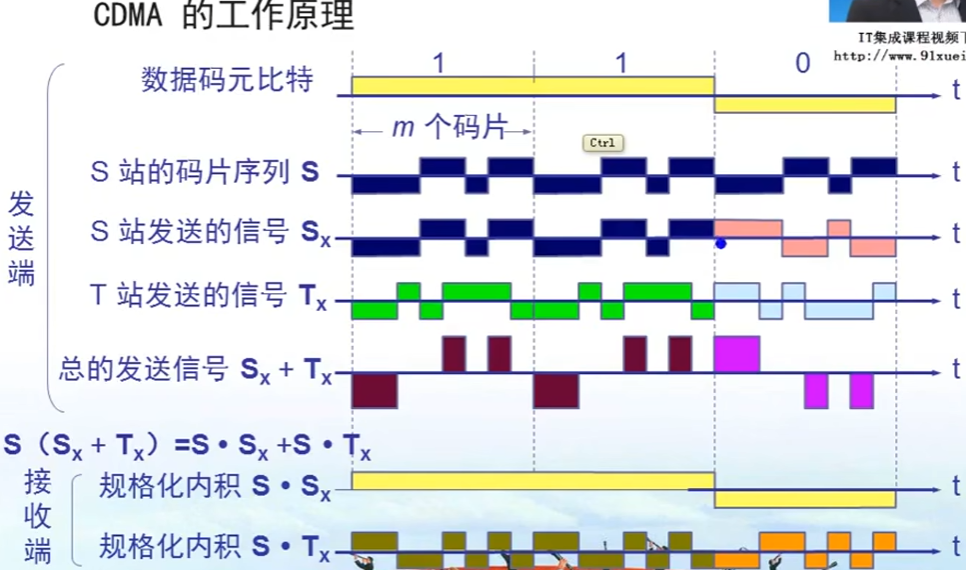

